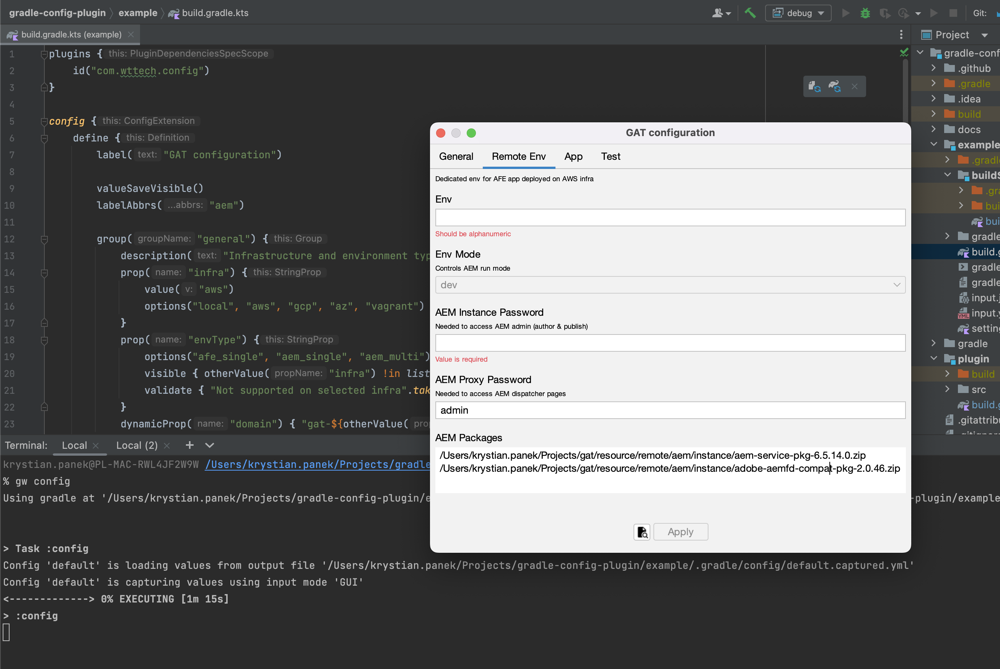

[](https://www.wundermanthompson.com/service/technology)

[](http://www.apache.org/licenses/)

# Gradle Config Plugin

## About

Instead of asking build users to write magic and hard-to-remember CLI options like `-PpropName=propValue`... how about just requesting input values using GUI?

Plugin handles defining configuration for Gradle via DSL with ability to capture values using multiple input modes:

- human friendly GUI (Mac and Window users): `sh gradlew config --gui`
- fallback CLI (e.g for Windows & WSL): `sh gradlew config --cli`
- static file (e.g on CI/CD systems): `sh gradlew config --file path/to/input.<yml|json>`

Other concepts / features:

- super flexible everything (things could be configured by functions/lambdas)
- two-way binding between properties source values and between properties rendered on the dialog
- easily accessible values by the Gradle build - `config["propName"]`
- programmable visibility and enablement of property groups and fields
- programmable default values provided to the build even if input is not yet captured
- programmable validation
- providing filtered values to be read by other tools (Terraform/Packer TF vars, Ansible, etc).

### Example screenshot



### Example usage

```kotlin
plugins {
    id("com.wttech.config")
}

config {
    define {
        label("GAT configuration")

        valueSaveVisible()
        labelAbbrs("aem")

        group("general") {
            description("Infrastructure and environment type selection")
            prop("infra") {
                value("aws")
                options("local", "aws", "gcp", "az", "vagrant")
            }
            prop("envType") {
                options("afe_single", "aem_single", "aem_multi")
                visible { otherValue("infra") !in listOf("local", "vagrant")}
                validate { "Not supported on selected infra".takeIf { groups.get().none { it.name == "remote-${otherValue("infra")}_${value()}" } } }
            }
            dynamicProp("domain") { "gat-${otherValue("infra")}.wttech.cloud" }
        }
        group("local") {
            label("Local Env")
            description("Environment set up directly on current machine")
            visible { value("infra") == name }

            prop("monitoringEnabled") {
                options("true", "false")
                checkbox()
            }
        }
        group("remote-aws_afe_single") {
            label("Remote Env")
            description("Dedicated env for AFE app deployed on AWS infra")
            visible { name == "remote-${value("infra")}_${value("envType")}" }

            prop("env") {
                value("kp")
                alphanumeric()
            }
            prop("envMode") {
                options("dev", "stg", "prod")
                description("Controls AEM run mode")
                enabled { otherStringValue("env") == "kp" }
            }
            prop("aemInstancePassword") {
                valueDynamic { otherStringValue("env")?.takeIf { it.isNotBlank() }?.let { "$it-pass" } }
                description("Needed to access AEM admin (author & publish)")
                required()
            }
            prop("aemProxyPassword") {
                value("admin")
                description("Needed to access AEM dispatcher pages")
                required()
            }
            listProp("aemPackages") {
                values("a", "b", "c")
            }
        }
        group("app") {
            description("Application build settings")
            prop("mavenArgs") {
                value("-DskipTests")
            }
        }
        group("test") {
            description("Automated tests execution settings")
            prop("percyToken")
            prop("percyEnabled") {
                checkbox()
            }
            dynamicProp("testBaseUrl") {
                when (otherStringValue("infra")) {
                    "local" -> "https://publish.local.gat.com"
                    else -> "https://${otherValue("env")}.${otherValue("domain")}"
                }
            }
        }
    }
}

tasks {
    register("printAemInstancePassword") {
        doLast {
            println(config["aemInstancePassword"])
        }
    }
}
```

## Debugging tests

To debug plugin source code while:

* running functional tests, append `--debug-jvm -Porg.gradle.testkit.debug=true`.
* project using plugin, append `--no-daemon -Dorg.gradle.debug=true`.

Gradle will stop for a moment and wait until remote connection at port 5005 will be established from e.g IDE.

## Contributing

Issues reported or pull requests created will be very appreciated. 

1. Fork plugin source code using a dedicated GitHub button.
2. Do code changes on a feature branch created from *develop* branch.
3. Create a pull request with a base of *develop* branch.

## License

**Gradle AEM Plugin** is licensed under the [Apache License, Version 2.0 (the "License")](https://www.apache.org/licenses/LICENSE-2.0.txt)
